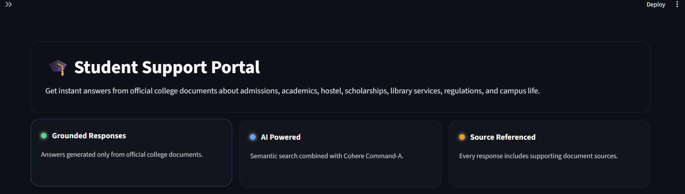
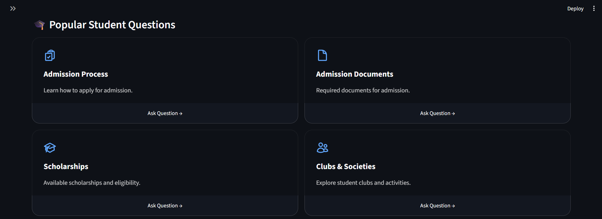
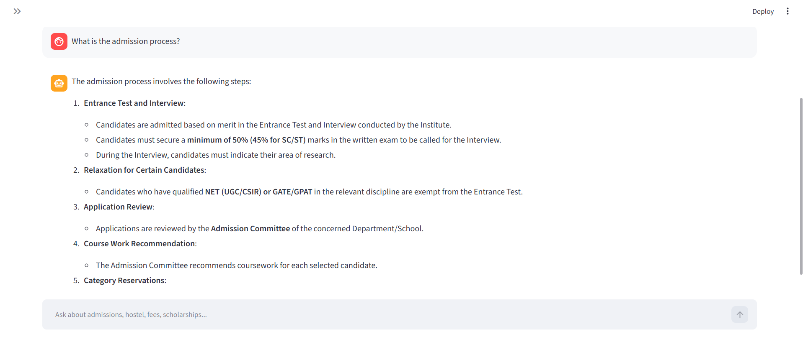
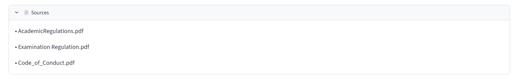

# 🎓 Student Support AI

> An AI-powered student support portal built with **Retrieval-Augmented Generation (RAG)** that answers student queries using official institutional documents while providing **grounded, transparent, and privacy-aware** responses.

<p align="center">

A Retrieval-Augmented Generation (RAG) application for answering student queries using official institutional documents.

</p>

<p align="center">


</p>

<p align="center">

<a href="YOUR_STREAMLIT_LINK">🌐 Live Demo</a> •
<a href="#features">✨ Features</a> •
<a href="#architecture">🏗 Architecture</a> •
<a href="#installation">⚙ Installation</a>

</p>

---



---

# 📖 Overview

Student Support AI is a Retrieval-Augmented Generation (RAG) application that enables students to ask questions about admissions, academics, scholarships, hostel facilities, placements, and other campus-related topics using official institutional documents as its knowledge base.

The application combines **FAISS semantic search**, **Maximum Marginal Relevance (MMR)** retrieval, and **Cohere Command-A** to generate grounded responses based solely on retrieved document context. Every answer includes its supporting source document(s), enabling users to verify the origin of the information.

To improve portability and protect organizational identity, the application incorporates a custom **Privacy-Aware Anonymization Layer** that removes institution-specific identifiers before responses are presented to users.

This project demonstrates how modern LLM applications can combine semantic retrieval, grounded generation, privacy-aware processing, and source attribution to build reliable AI assistants over institutional knowledge bases.

---

# 🎯 Key Objectives

- Build a reliable question-answering system over institutional documents.
- Reduce hallucinations through grounded response generation.
- Improve transparency through source attribution.
- Preserve institutional privacy using an anonymization layer.
- Provide a clean and intuitive user experience.

---

# 💡 Why This Project?

The goal of this project was not simply to build another RAG chatbot, but to design a student support system that demonstrates practical AI engineering principles. Throughout development, the focus extended beyond accurate question answering to include response reliability, transparency, privacy, and a polished user experience.

By combining semantic retrieval, grounded response generation, source attribution, Maximum Marginal Relevance (MMR) retrieval, predefined response handling, and a custom privacy-aware anonymization layer, this project explores how modern LLM applications can be designed to be more trustworthy, maintainable, and reusable.

The resulting application showcases how Retrieval-Augmented Generation (RAG) can be applied to real-world institutional support while emphasizing engineering decisions that improve both user trust and system quality.

--- 

# ✨ Features

- 📚 Retrieval-Augmented Generation (RAG)
- 🔎 FAISS Semantic Search with Maximum Marginal Relevance (MMR)
- 🤖 Grounded response generation using Cohere Command-A
- 📄 Automatic source attribution for every answer
- 🔒 Privacy-aware anonymization layer
- 💬 Predefined response handling for greetings
- ⚡ Interactive Streamlit interface
- 🎨 Responsive UI with reusable custom components

> [!NOTE]
> Responses are generated only from retrieved document context. If sufficient information is unavailable, the chatbot responds accordingly instead of generating unsupported information.

> [!TIP]
> Every response includes the supporting source document(s) used during retrieval.

---

# 🏗 Architecture

```text
                     User Question
                           │
                           ▼
              FAISS Retriever (MMR)
                           │
                           ▼
               Retrieve Relevant Chunks
                           │
                           ▼
                Prompt Construction
                           │
                           ▼
         Privacy / Anonymization Layer
                           │
                           ▼
               Cohere Command-A LLM
                           │
                           ▼
           Answer + Source Documents
```

> [!IMPORTANT]
> The anonymization layer replaces institution-specific identifiers with neutral references such as **"the college"**, allowing the application to remain reusable across different organizations.

---

## 📸 Application Preview

## 🏠 Home Page

Shows the landing page with the hero section and key capabilities.


---

## 🎓 Popular Student Questions

Quick-access cards for common student queries with reusable custom UI components.



---

## 💬 Chat Interface

Grounded AI responses generated from retrieved document context.



---

## 📄 Source Attribution

Every response includes supporting document references to improve transparency.



---

# 🛠 Tech Stack

| Category | Technology |
|-----------|------------|
| Language | Python |
| Frontend | Streamlit |
| Framework | LangChain |
| LLM | Cohere Command-A |
| Embeddings | Sentence Transformers |
| Vector Store | FAISS |
| Retrieval | Maximum Marginal Relevance (MMR) |
| Document Loader | PyPDF |

---

# ⚙ Installation

> [!TIP]
> If you're using your own documents, place the PDF files inside the `data/` directory before building the vector database.

## Clone the repository

```bash
git clone https://github.com/achal-shukla/Student-Support-AI.git
cd Student-Support-AI
```

## Install dependencies

```bash
pip install -r requirements.txt
```

## Configure the API key

Create:

```text
.streamlit/secrets.toml
```

Add:

```toml
COHERE_API_KEY="YOUR_API_KEY"
```

> [!IMPORTANT]
> API keys are managed securely using **Streamlit Secrets** and are never stored in the repository.

## Add your documents

Place PDF documents inside:

```text
data/
```

## Build the vector database

```bash
python build_index.py
```

## Run the application

```bash
streamlit run app.py
```

---

# 🚀 Usage

1. Launch the application.
2. Ask a question.
3. Relevant document chunks are retrieved.
4. Cohere Command-A generates a grounded response.
5. Supporting source document(s) are displayed below every answer.

> [!TIP]
> Whenever new documents are added, rebuild the vector database by running:

```bash
python build_index.py
```

---

# 📂 Project Structure

```text
Student-Support-AI/

├── assets/
│   ├── icons/
│   └── screenshots/
├── data/
├── vector_store/
├── app.py
├── build_index.py
├── chain.py
├── components.py
├── config.py
├── faiss_store.py
├── inspect_retrieval.py
├── llm.py
├── prompt.py
├── rag.py
├── responses.py
├── styles.css
├── text_cleaner.py
├── requirements.txt
├── README.md
└── .gitignore
```

---

# ⚙ Engineering Highlights

### 🎯 Grounded Response Generation

The chatbot generates responses only from retrieved document context, reducing hallucinations and improving answer reliability.

---

### 🔒 Privacy-Aware Anonymization

A custom anonymization layer protects institutional identity by replacing organization-specific references with neutral terminology.

**It also:**

- Replaces institution names with **"the college"**
- Intercepts institution identity questions
- Sanitizes retrieved context before generation
- Makes the application reusable across different organizations

---

### 🔎 Maximum Marginal Relevance (MMR)

Instead of standard similarity search, the application uses **MMR retrieval** to improve diversity among retrieved document chunks and reduce redundant context.

---

### 📄 Source Transparency

Every generated response includes its supporting source document(s), enabling users to verify where the information originated.

---

### 💬 Intent-Based Greeting Handling

Common greetings are handled through predefined responses instead of invoking the retrieval pipeline, resulting in faster and more natural interactions.

---

# 🚀 Future Improvements

- [ ] Clickable PDF citations
- [ ] Conversation memory
- [ ] Admin portal for document uploads
- [ ] Authentication and user roles
- [ ] Citation highlighting
- [ ] Multi-institution support

---

# 📜 License

This project is licensed under the MIT License.

---

# 🙏 Acknowledgements

<p align="center">

Built with ❤️ using Python, Streamlit, LangChain, FAISS, Sentence Transformers, and Cohere Command-A.

</p>
